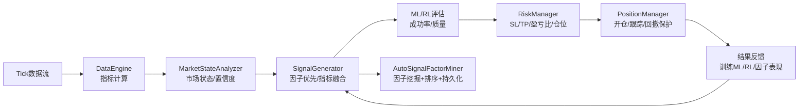
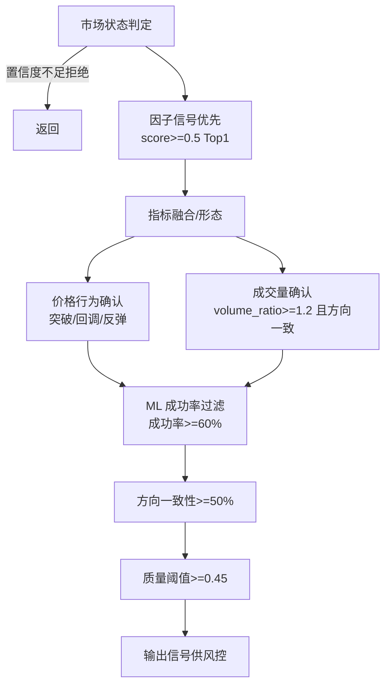

# 专业复杂交易策略白皮书（设计思路 & 逻辑推理版）

> 文件位置：`TRADIN/STRATEGY_README.md`，核心逻辑在 `TRADIN/main.py`。所有可调参数集中于 `ProfessionalComplexConfig`。

---

## 1. 总体设计与运行入口
- 标的：黄金（`Gold`/`GOLD`/`XAUUSD` 自动探测）。
- 核心原则：**技术分析定价**（ATR+支撑阻力确定 SL/TP，不靠盈亏比反推）、**成本内嵌**（手续费 $50/手 + 点差）、**信号高质量**（价格行为+成交量+ML/RL）、**单一止盈+回撤保护**（分段止盈已禁用）。
- 入口：`main()` -> `ProfessionalComplexStrategy.run_strategy()`。

### 1.1 设计思路（论文式摘要）
- 目标：在高成本（$50/手）与点差条件下，获得**净盈亏比≥1.5**的稳定策略。
- 核心假设：止盈/止损应由**市场结构与波动**决定（ATR+支撑阻力），而非反推目标盈亏比；若技术止盈无法覆盖成本并满足最低 R:R，则说明信号质量不足，应拒绝交易。
- 方法：
  1) **信号高质量先行**：ML 预测成功率≥60%，方向一致性≥50%，价格行为+成交量确认。
  2) **技术定价**：SL/TP 基于 ATR×状态调整 + 结构位，覆盖成本后再做 R:R 校验。
  3) **成本内生化**：手续费、点差进入 SL/TP 与 R:R 验证、仓位 sizing。
  4) **单一止盈 + 盈利回撤保护**：避免分段止盈稀释 R:R，用动态TP与回撤保护锁定利润。
  5) **持续学习**：因子挖掘（模板+数据驱动）、ML/RL 双重评估，持久化优质因子。
- 结论：以**技术驱动的价格目标**替代**盈亏比驱动的价格目标**，配合高标准信号过滤与成本约束，可提升实际净 R:R，并降低“高成本环境下的过度交易”风险。

### 全局数据流示意（Mermaid）

---

## 2. 模块与职责（定位类名）
- `ProfessionalComplexStrategy`：主循环与调度。
- `ProfessionalTickDataEngine`：Tick 缓冲、指标计算、数据校验。
- `AdvancedMarketStateAnalyzer`：市场状态判定（TRENDING/RANGING/VOLATILE/UNCERTAIN）。
- `ProfessionalSignalGenerator`：信号生成与强化（因子→指标融合→ML/RL→价格/量确认）。
- `ComplexRiskManager`：止损/止盈计算、盈亏比校验、仓位 sizing。
- `ProfessionalPositionManager`：开仓、动态TP、盈利回撤保护、持仓回写。
- `AutoSignalFactorMiner`：因子挖掘、评分、Top10 选择、持久化。
- `MLSignalEvaluator` / `RLSignalMiner` / `RLSignalQualityEvaluator`：ML 评估、RL 挖掘、RL 质量评级。

---

## 3. 配置总览（集中修改处）
位置：`main.py` 顶部 `class ProfessionalComplexConfig`。修改参数无需改动逻辑。

### 账户与品种
- `LOGIN/PASSWORD/SERVER`：MT5 账户。
- `SYMBOL_CANDIDATES`、`DEFAULT_SYMBOL`：品种探测。
- `POINT_VALUE=1.0`，`POINT=0.01`，`TICK_SIZE=0.01`。

### 仓位与风险
- `MIN_LOT=0.1`，`MAX_LOT=5.0`，`LOT_STEP=0.1`。
- `RISK_PER_TRADE=0.002`（每笔 0.2%）。
- `MAX_CONCURRENT_TRADES=3`，`MAX_DAILY_TRADES=50`，`MAX_DRAWDOWN=0.05`。

### 成本与盈亏比
- `COMMISSION_PER_LOT=50.0`（开平合计），`SPREAD_COST_ENABLED=True`，`SPREAD_COST_MULTIPLIER=0.3`。
- `MIN_RISK_REWARD_RATIO=1.5`（净盈亏比门槛）。
- `RR_POSITION_ADJUSTMENT=True`，`MIN_RR_FOR_FULL_SIZE=2.5`（盈亏比越低，手数越小）。

### 信号生成与过滤
- `SIGNAL_GENERATION`：`MIN_STRENGTH`（默认0.45）、`FILTERS['MIN_TICKS_BETWEEN_SIGNALS']`（信号节流）。
- `TREND_START_DETECTION`：`MIN_SIGNAL_STRENGTH`=0.45 等。
- `TREND_EXHAUSTION`：趋势衰竭判定。

### 止盈/止损/保护
- `DYNAMIC_TAKE_PROFIT`：是否启用、ADX 阈值（25）、ATR 倍数、仅强趋势。
- `MULTI_TARGET_TP.ENABLE=False`：分段止盈已禁用。
- `PROFIT_DRAWDOWN_CONTROL`：`MIN_PEAK_PROFIT_USD`、`MAX_DRAWDOWN_USD`、`MAX_DRAWDOWN_PCT`、`ADAPTIVE_THRESHOLD`、`TREND_AWARE`、`DUAL_PROTECTION`。

### 数据与指标
- Tick/多周期：`TICK_BUFFER_SIZE`、`PRICE_BUFFER_SIZE`、`PROCESSING_INTERVAL`、`MIN_TICKS_FOR_ANALYSIS`、`TICK_TIMEFRAMES`。
- `TECHNICAL_INDICATORS`：RSI/MACD/EMA/布林/STOCH/CCI/W%R/KDJ/ATR 等周期与阈值。

---

## 4. 信号生成链路（细节 + 关键阈值）

- 价格行为：`BREAKOUT_UP/DOWN`，`PULLBACK_BUY`，`BOUNCE_SELL`，命中加权确认。
- 成交量：`volume_ratio>=1.2` 且 `vwap_position` 方向一致加 0.15；`volume_ratio<=0.8` 降低确认度。
- 成功率过滤：`MLSignalEvaluator` 成功率 < 0.60 拒绝。
- 方向一致性：多指标一致性提升至 50% 以上才通过。
- 质量阈值：自动因子信号质量 < 0.45 拒绝。

---

## 4.1 逻辑推理与设计论证

| 设计点 | 理由 | 影响 | 若放宽/取消 |
| --- | --- | --- | --- |
| 成功率过滤 ≥60% | 高成本下需更高命中率，否则手续费吞噬利润 | 提升信号质量，降频率 | 成本占比抬升，净 R:R 下降 |
| 方向一致性 ≥50% | 多指标一致性提高方向置信度 | 降低反向误判 | 震荡市误信号增加 |
| 技术定价 SL/TP | 以 ATR+结构位衡量真实可达空间 | 避免“目标价虚高” | R:R 可能虚假改善但实际难达到 |
| 覆盖成本再校验 R:R≥1.5 | 把手续费/点差纳入分子分母 | 确保净收益为正 | 高成本环境可能频繁拒单 |
| 单一止盈 + 回撤保护 | 保持清晰 R:R，动态保利润 | 净 R:R 可预测，趋势中保护收益 | 分段止盈会稀释 R:R，收益不稳 |
| 动态 TP 仅强趋势 | 强趋势下拉大盈亏差 | 提升趋势跟随收益 | 若弱势也动态TP，易过度拉远 TP |
| 因子评分与持久化 | 复用优质因子，减少冷启动 | 稳定表现，降低回撤 | 不持久化则每次重启需重学 |

参考思路（类论文格式）：
- 技术定价与成本内生化类似于“execution-aware signal design”（参见微观结构交易文献对成交成本与滑点的强调）。
- 单一止盈 + 回撤保护的组合，与“trailing stop / peak protection”在趋势追踪策略中的常见做法一致。
- 因子挖掘与重要性加权，借鉴了特征选择与模型集成中“性能加权投票”的思想。

---

## 5. 风险管理与价格计算（含公式）

### 止损计算 `calculate_stop_loss_distance`
- 基础 ATR 倍数：强信号>0.7 → ~1.5 ATR；中等 1.2 ATR；弱 1.0 ATR。
- 市场状态调整：趋势 ×1.1，震荡 ×0.9，波动 ×1.2。
- 结构位约束：BUY 不低于支撑；SELL 不高于阻力。
- 下限距离：需覆盖手续费并满足最小盈亏比，避免过近被噪音扫损。

### 止盈计算 `calculate_take_profit_levels`（单一止盈）
- 技术驱动：ATR 倍数 + 支撑/阻力 + 市场状态，强趋势可启用动态 TP（ADX≥25）。  
- 止盈距离必须覆盖手续费：`min_tp_distance >= (commission_per_lot * 1.5) / tick_value`。
- 动态 TP：强趋势时按 ATR/ADX 自适应抬升。

### 盈亏比校验 `validate_risk_reward_ratio`
- 净盈亏比 = `(预期盈利 - 手续费 - 点差成本) / (止损损失 + 手续费 + 点差成本)`  
- 要求 ≥ `MIN_RISK_REWARD_RATIO=1.5`；不足则拒绝开仓（不改价，只拒单或缩手数）。

### 仓位计算 `calculate_position_size`
- 风险金额 = 余额 × `RISK_PER_TRADE`；手数迭代考虑手续费+点差。  
- 若盈亏比 < `MIN_RR_FOR_FULL_SIZE`，按比例缩减手数（不动 SL/TP）。

---

## 6. 持仓管理与保护
- 开仓：`open_position` 先下单后设 SL/TP，价格按 `digits` 规范化。
- 动态止盈：强趋势场景下 `_update_take_profit` 可抬升 TP。
- 盈利回撤保护：`_monitor_profit_drawdown` 双阈值（美元/百分比），趋势转弱更早执行。
- 多目标止盈：彻底禁用，无残留逻辑。

---

## 7. 机器学习 / 强化学习
- **MLSignalEvaluator**：随机森林/GBDT，特征含信号强度、融合置信度、ADX、EMA 对齐、MACD、RSI、动量、成交量比、状态置信度等；输出质量分与成功率，自动存取模型。
- **RLSignalMiner**：DQN 挖掘新模式（趋势启动/反转/突破/回调），经验回放+目标网络。
- **RLSignalQualityEvaluator**：RL 质量等级 → `combined_quality_score` 与推荐。
- **在线学习**：交易结果回写 ML/RL/因子表现，定期再训练（默认每 1 小时 ML 训练，如样本足够）。

---

## 8. 自动因子挖掘与持久化
- 周期：默认每 5 分钟 `mine_factors()`；Top10 因子按综合评分优先。
- 发现：模板因子 + 数据驱动（特征重要性、组合、相关性、聚类、决策树、遗传算法）。
- 评分：综合=胜率40% + 平均盈利30% + 盈亏比30%；阈值≥0.2。
- 持久化：`discovered_factors.json`、`factor_performance.json` 自动读写，重启继承历史表现。
- 动态指标发现：自动合并可用指标与默认指标池。

---

## 9. 关键调优清单（改哪一行）
- 信号强度/频率：`SIGNAL_GENERATION['MIN_STRENGTH']`，`FILTERS['MIN_TICKS_BETWEEN_SIGNALS']`。
- 方向一致性：`_enhance_direction_confirmation` 中一致性阈值（已提升到约 50%）。
- 成功率门槛：`min_success_probability=0.60`（在 `_evaluate_and_enhance_signal` 内）。
- 盈亏比门槛：`MIN_RISK_REWARD_RATIO=1.5`；更保守可调高，激进可调低但风险升高。
- 手续费假设：`COMMISSION_PER_LOT=50.0`；若经纪商不同需同步调整。
- 动态止盈：`DYNAMIC_TAKE_PROFIT['ENABLE']`、`MIN_ADX_FOR_DYNAMIC`、ATR 倍数。
- 盈利回撤保护：`PROFIT_DRAWDOWN_CONTROL` 的美元/百分比阈值、自适应开关、趋势感知开关。
- 因子挖掘：`factor_mining_interval`（策略级）；`AutoSignalFactorMiner` 内最小样本/胜率/夏普/盈亏比阈值。

---

## 10. 运行与文件
- 运行：`python TRADIN/main.py`
- 日志：`professional_complex_fixed.log`
- 模型/因子：`signal_evaluator_model.pkl`、`discovered_factors.json`、`factor_performance.json`
- 校验：`python -c "import py_compile; py_compile.compile('TRADIN/main.py', doraise=True)"` 进行语法快速检查
- 分段止盈：已禁用，单一 TP + 回撤保护为主

---

## 11. 调试与验证建议
- 检查日志：关注拒单原因（成功率<60%、盈亏比<1.5、质量<0.45、方向一致性不足）。
- 回测要点：  
  - SL 不应过近（需覆盖手续费+结构位）；  
  - TP 覆盖手续费且具备技术空间；  
  - 盈亏比校验必须生效；  
  - 动态 TP 仅强趋势触发；  
  - 回撤保护在盈利回撤达阈值时执行。

---

## 12. 速览：从信号到下单的关键数值链
1) 成功率 ≥ 60% （ML）  
2) 方向一致性 ≥ 50%  
3) 质量 ≥ 0.45（自动因子信号）  
4) 止盈/止损：技术分析确定（ATR+结构位），必须覆盖手续费  
5) 净盈亏比 ≥ 1.5，否决开仓  
6) 手数：按风险/盈亏比迭代计算，盈亏比低则缩手  
7) 回撤保护：盈利峰值回撤超阈值即止盈

---

## 13. 参考定位（快捷跳转）
- 配置：`class ProfessionalComplexConfig`
- 信号：`class ProfessionalSignalGenerator`，方法 `_enhance_direction_confirmation`、`_evaluate_and_enhance_signal`
- 因子：`class AutoSignalFactorMiner`，`generate_signals_from_factors`、`_save/_load`
- 风控：`class ComplexRiskManager`，`calculate_stop_loss_distance`、`calculate_take_profit_levels`、`validate_risk_reward_ratio`、`calculate_position_size`
- 持仓：`class ProfessionalPositionManager`，`open_position`、`_monitor_profit_drawdown`、`_update_take_profit`
- 主控：`class ProfessionalComplexStrategy`，`run_strategy`

